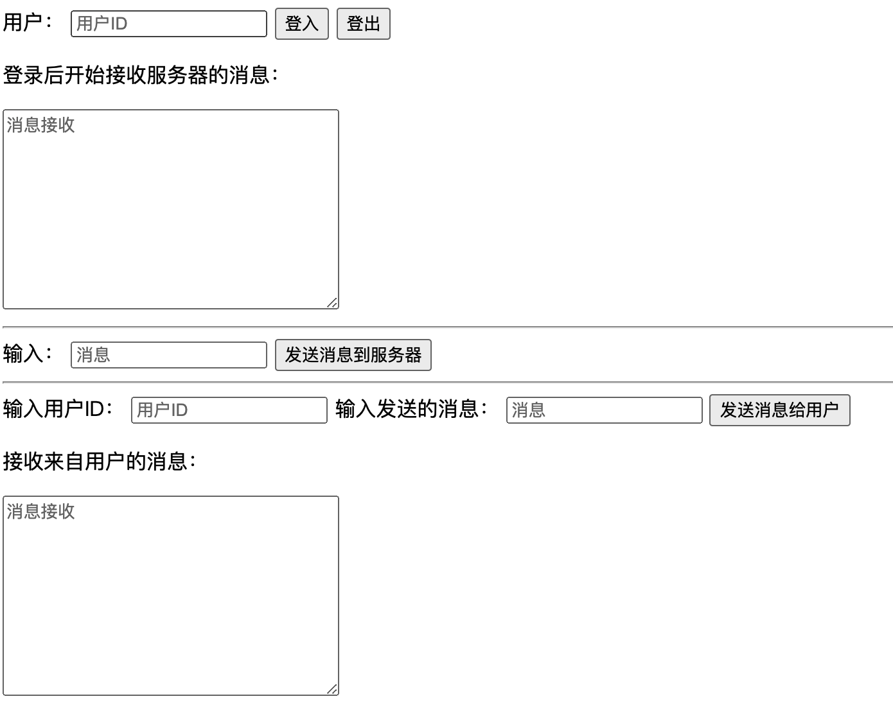
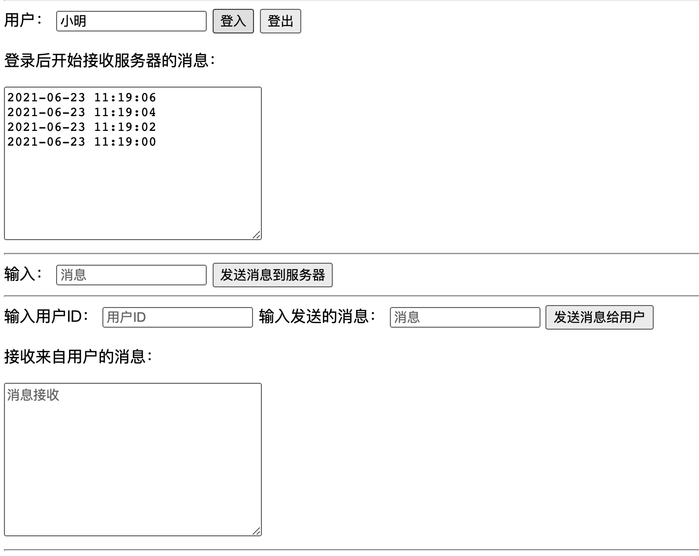
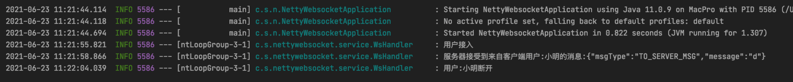
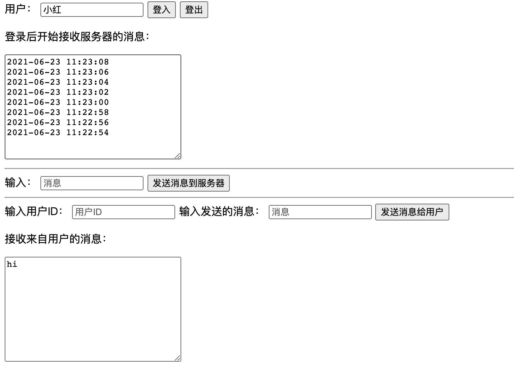

# netty-websocket-demo
用netty实现简单的websocket聊天

```html
.
├── main
│   ├── java
│   │   └── com
│   │       └── swayingleaves
│   │           └── nettywebsocket 后端
│   │               ├── NettyWebsocketApplication.java
│   │               ├── entity 消息实体
│   │               │   └── Msg.java
│   │               ├── service netty配置
│   │               │   ├── NettyGroupCache.java
│   │               │   ├── WsHandler.java
│   │               │   └── WsServer.java
│   │               └── task 定时任务
│   │                   └── Task.java
│   └── resources
│       └── web 前端
└── test 测试
```
> 前端页面 



> 测试





